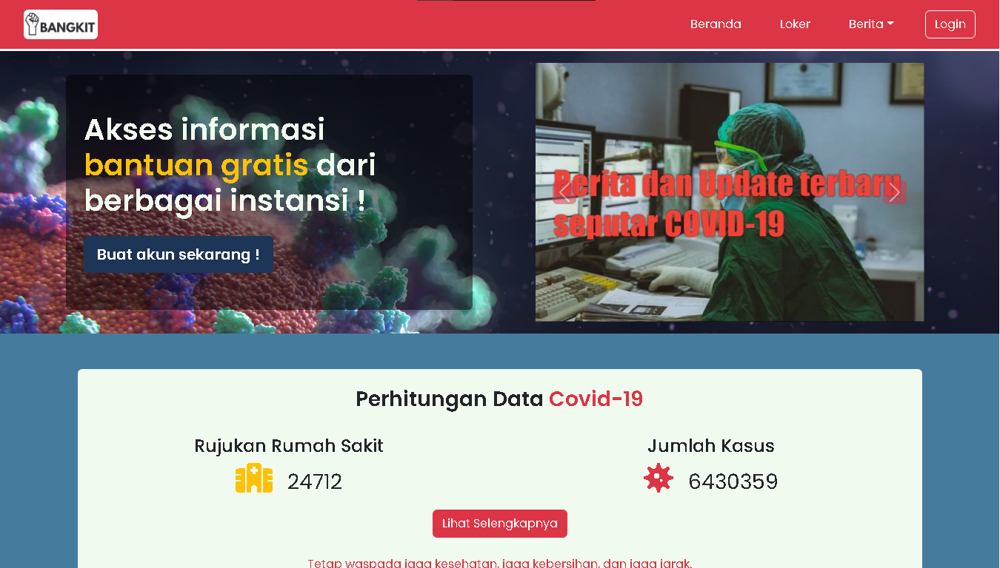

 

## **Deskripsi Singkat**

- **Pengenalan :** Bangkit.com adalah sebuah platform digital yang menawarkan fitur untuk menghubungkan masyarakat umum yang terdampak pandemi, terutama dari sektor ekonomi, dengan instansi-instansi perusahaan atau pemerintah yang menyediakan bantuan atau solusi dari permasalahan-permasalahan yang muncul akibat pandemi.

- **Konteks :** Group Project - Stage Web Development Basic & Advance, Skilvul Tech4Impact Cycle 3 SIB Kampus Merdeka.

- **Challange Partner :** National University of Singapore.

- **Permasalahan :**  Pandemi covid-19 mengakibatkan dampak buruk bagi masyarakat sekitar, terutama pada sektor ekonomi banyak yang hilang pekerjaan nya karena akibat di PHK.
## **Solusi yang kami tawarkan berdasarkan permasalahan tersebut** 
- **Informasi Bantuan Loker, di prioritaskan untuk para pekerja yang terkena dampak phk akibat pandemi Covid-19**

- **Article dan info terbaru seputar perkembangan Covid-19**

## **Inovasi Fitur dari Produk Digital yang kami tawarkan**
- **Login & Register User**

- **Informasi Lowongan Pekerjaan**

- **Menyediakan Informasi angka penyebaran kasus Covid-19 di berbagai provinsi**

- **Article kesehatan dan video motivasi yang diharapkan dapat membantu para target user**

## **Target User**

- **Gender :** Semua
- **Age range :**
    - Pelajar
    - Dewasa
- **Geographical range :** Indonesia
- **Occupation :** Masyarakat umum dan Pelajar
- **Habits & Behavior :**
    - Untuk masyarakat umum yang terdampak covid 19, khususnya:
        - Pekerja yang tidak memiliki pekerjaan karena di PHK atau terdampak covid 19
        - Masyarakat umum yang ingin melihat perkembangan update terbaru covid-19
        - Para pelajar/mahasiswa yang ingin mendapat bantuan beasiswa gratis

## **Timeline Pengerjaan**
- **15 Oct 2022 :** Menyusun BRD & Membuat Wireframe Mobile
- **16 Oct 2022 :** Membuat Wireframe Desktop & User Flow
- **17 - 23 Oct 2022 :** Developing Web
- **23 Oct 2022 :** Membuat slide presentasi
- **24 Oct 2022 :** Mendeploy web ke netlify

## **Tools & alat bantu yang digunakan**
- Whimsical
- Git & GitHub
- Visual Studio Code
- Canva
- Netlify

## **Bahasa Pemograman & Library**
- HTML & CSS
- JavaScript native
- DOM
- Session Storage
- Bootstrap 5
- Font Awesome 6
- Sweet Alert
- External API

## **Penampakan Tampilan Interface**

 

### URL Web : https://bangkit-app-fe.netlify.app/
